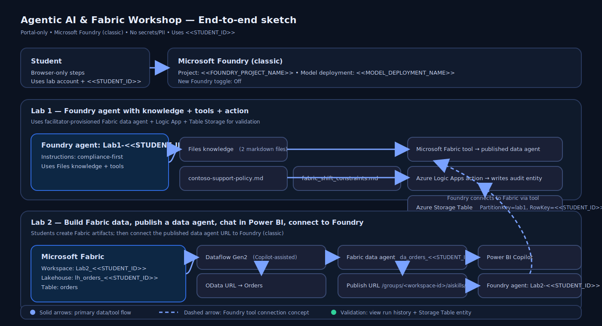

# Agentic AI & Fabric Workshop (Student)

## Learning objectives
- Complete a portal-only walkthrough of Microsoft Foundry (classic) to understand the key project areas.
- Create a compliance-first agent and validate grounded answers from uploaded files.
- Connect a Microsoft Fabric data agent and validate a successful tool call.
- Connect a pre-provisioned Azure Logic Apps workflow and validate it writes an entity to Azure Table storage.
- Build Fabric lakehouse data with Dataflow Gen2 + Copilot and connect it to a Foundry agent.

## Prereqs
- You have a web browser and you can sign in with your lab account.
- Your facilitator provides these exact values:
  - **Foundry project name:** `2026-02-05-agentic-ai-us`
  - **Model deployment name:** `gpt-5-chat`
  - **Your student ID (no names/emails):** `<<STUDENT_ID>>` (example format: `student-07`)
  - **Fabric data agent endpoint URL:** `<<FABRIC_DATA_AGENT_ENDPOINT_URL>>` (format: `https://<environment>.fabric.microsoft.com/groups/<workspace_id>/aiskills/<artifact-id>`)
  - **Logic App workflow name:** `la-20260205-agentic-ai`
  - **Storage account name:** `sa20260205agenticai`
  - **Storage table name:** `audit20260205`
  - **Fabric capacity name (Lab 2):** `fc-20260205-agentic-ai`

## Estimated time
150–210 minutes

## Architecture sketch

- You build an agent in Microsoft Foundry (classic).
- The agent uses file knowledge (uploaded policy docs) for grounding.
- The agent uses a Fabric data agent for data-backed answers.
- The agent uses a Logic App action to write an auditable record to Azure Table storage.

## Step-by-step
1. (Browser) Start with **Lab 1**: [workshop/LAB-INSTRUCTIONS 001.md](workshop/LAB-INSTRUCTIONS%20001.md)
2. Then continue to **Lab 2**: [workshop/LAB-INSTRUCTIONS 002.md](workshop/LAB-INSTRUCTIONS%20002.md)

## Validation
- You can open Lab 1 and Lab 2 instructions and you have the required placeholders from your facilitator.

## Cleanup
1. (Browser) Close the browser tab.

## Compliance / safety notes
- Do not enter secrets, tokens, access keys, names, or emails in prompts.
- Use only your assigned `<<STUDENT_ID>>` as an identifier.

## References
- https://learn.microsoft.com/en-us/azure/ai-foundry/what-is-foundry?view=foundry-classic
