# Workshop end-to-end sketch


- Lab 1 focuses on building a Foundry (classic) agent with file grounding, a Fabric tool connection, and a Logic Apps action.
- Lab 2 focuses on building Fabric data, publishing a Fabric data agent, using Copilot in Power BI, and connecting that data agent to Foundry.

---

# Lab 1 — Explore Microsoft Foundry (classic) and build an agent with knowledge + actions

## Description
In this lab, you’ll work in Microsoft Foundry (classic) to build a compliance-first agent that can answer questions using uploaded policy files (grounding) and can take actions using connected tools. You’ll validate file-grounded responses, call a pre-provisioned Microsoft Fabric data agent, and invoke an Azure Logic Apps workflow that writes an audit record to Azure Storage Table.

## Learning outcomes
By the end of this lab, you can:
- Confirm you are using Microsoft Foundry (classic) and navigate key areas (Models + endpoints, Guardrails, Agents).
- Create an agent with clear compliance-first instructions.
- Upload files as knowledge and verify responses are grounded in those files.
- Connect a Microsoft Fabric data agent and validate a successful tool call.
- Add an Azure Logic Apps action, write a single audit entity, and verify it in Azure Storage Table.

## Prereqs
- You have a web browser and you can sign in with your lab account.
- Your facilitator provides these exact values:
    - **Foundry project name:** `2026-02-05-agentic-ai-us`
    - **Model deployment name:** `gpt-5-chat`
    - **Your student ID (no names/emails):** `<<STUDENT_ID>>` (example format: `student-07`)
    - **Fabric data agent endpoint URL:** `<<FABRIC_DATA_AGENT_ENDPOINT_URL>>` (format: `https://<environment>.fabric.microsoft.com/groups/<workspace_id>/aiskills/<artifact-id>`)
    - **Logic App workflow name:** `la-20260205-agentic-ai`
    - **Storage account name:** `sa20260205agenticai`
    - **Storage table name:** `audit20260205`

- Your facilitator has already prepared these resources (students do not create Azure resources in this lab):
    - A Microsoft Foundry project with a model deployment named `gpt-5-chat`.
    - A published Microsoft Fabric data agent (you will use its published endpoint URL).
    - An Azure Logic Apps **Consumption** workflow that:
    - Is in the same subscription and resource group as the Foundry project.
    - Starts with a **Request** trigger (with a description).
    - Ends with a **Response** action.
            - Writes an entity to the table `audit20260205` in storage account `sa20260205agenticai`.
    - An Azure Storage account that contains a table named `audit20260205`.

- Required permissions (least privilege):
  - On the Foundry project: **Azure AI Developer**.
    - On the resource group `2026-02-05-agentic-ai-us-fabric-rg`: **Reader**.
  - On the project’s storage account (for file uploads): **Storage Blob Data Contributor**.
  - On the storage account (for validation in the Azure portal): **Storage Table Data Reader**.

- Download these two files to your computer (you will upload them in Foundry):
    - [assets/foundry/contoso-support-policy.md](../assets/foundry/contoso-support-policy.md)
    - [assets/foundry/fabric_shift_constraints.md](../assets/foundry/fabric_shift_constraints.md)
- For each file link, right-click the link and select **Save link as...**, then save the file to a folder you can find.

## Estimated time
90 minutes

## Architecture sketch


- A Foundry (classic) agent answers questions and uses knowledge/tools.
- File knowledge provides policy grounding from local markdown files.
- A Fabric data agent is connected as a knowledge tool for data-backed answers.
- A Logic App is connected as an action to write an audit entity to Azure Table storage.

## Step-by-step
1. (Browser) Open a new InPrivate/Incognito window (for example, press Ctrl+Shift+N).

2. (Browser) Open https://ai.azure.com/.

    <details>
    <summary>Screenshot: Azure AI Foundry: open ai.azure.com</summary>
    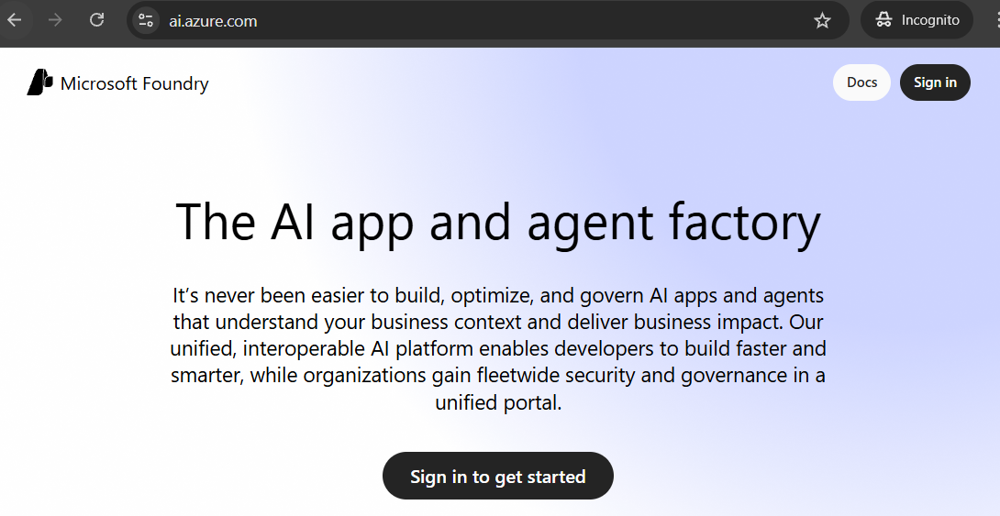
    </details>

3. (Browser) Sign in using the username and password supplied to you earlier.

    <details>
    <summary>Screenshot: Azure AI Foundry: sign in</summary>
    
    </details>

4. (Browser) When prompted, use the **Temporary Access Pass (TAP)**.

    <details>
    <summary>Screenshot: Microsoft Entra: Temporary Access Pass prompt</summary>
    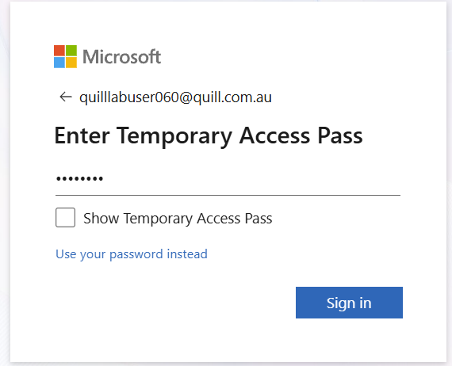
    </details>

5. (Microsoft Foundry) Set the **New Foundry** toggle to **Off**.

    <details>
    <summary>Screenshot: Azure AI Foundry: set New Foundry toggle Off</summary>
    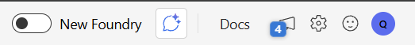
    </details>

6. (Microsoft Foundry) Select your project named `2026-02-05-agentic-ai-us`.

    <details>
    <summary>Screenshot: Azure AI Foundry: select project</summary>
    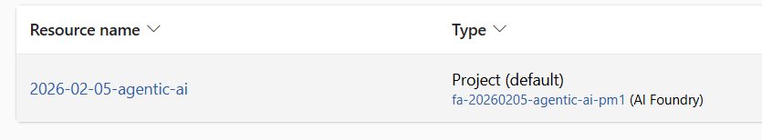
    </details>

7. (Microsoft Foundry) If you see it, select **Go to project**.

    <details>
    <summary>Screenshot: Azure AI Foundry: Go to project</summary>
    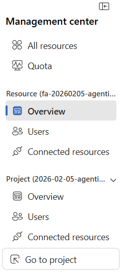
    </details>

8. (Microsoft Foundry) Select **Model catalog**.

    <details>
    <summary>Screenshot: Azure AI Foundry: Model catalog</summary>
    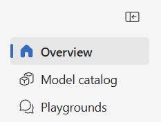
    </details>

9. (Microsoft Foundry) Select **Models + endpoints**.

    <details>
    <summary>Screenshot: Azure AI Foundry: Models + endpoints</summary>
    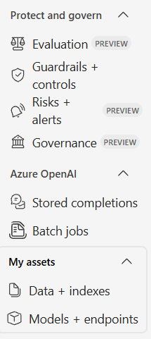
    </details>

10. (Microsoft Foundry) Select the deployment named `gpt-5-chat`.

    <details>
    <summary>Screenshot: Azure AI Foundry: select model deployment</summary>
    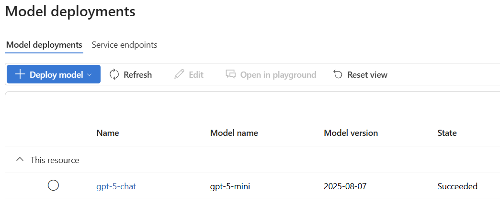
    </details>

11. (Microsoft Foundry) Select **Edit**, notice the **Content filter** option, then select **Cancel**.

    <details>
    <summary>Screenshot: Azure AI Foundry: edit deployment</summary>
    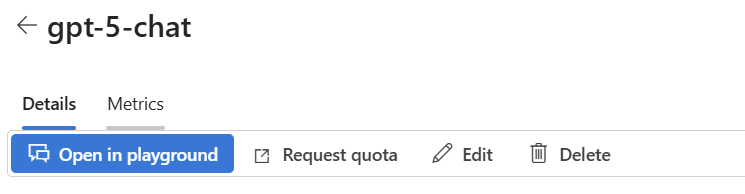
    </details>
    <details>
    <summary>Screenshot: Azure AI Foundry: content filter setting</summary>
    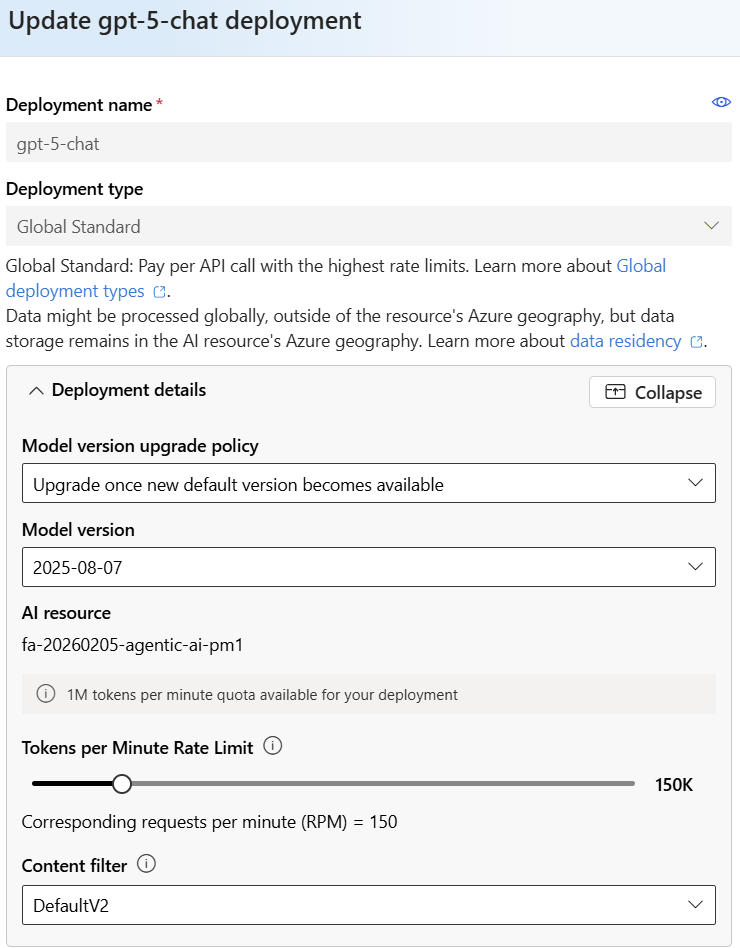
    </details>

    (Microsoft Foundry) Select **Guardrails + controls**.

    <details>
    <summary>Screenshot: Azure AI Foundry: Guardrails + controls</summary>
    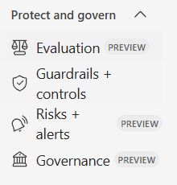
    </details>

    (Microsoft Foundry) Select the **Content filters** tab, then select the **Blocklists** tab.

     (Optional) Guardrails prompt demo (copy/paste):

     ```text
     Tell me about the merlion
     ```

    <details>
    <summary>Screenshot: Guardrails: allowed prompt example</summary>
    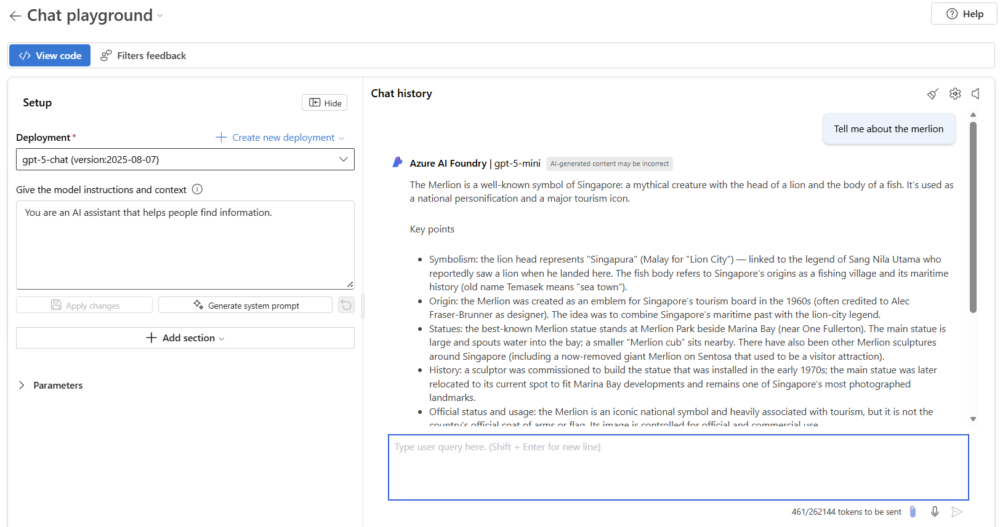
    </details>

     ```text
     Tell me about the unicorn
     ```

    <details>
    <summary>Screenshot: Guardrails: blocked prompt example</summary>
    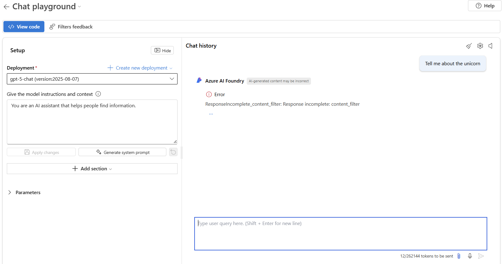
    </details>

     More prompt ideas (copy/paste):

     ```text
     Name the agent Lab1-07
     ```

     ```text
     Name the agent Lab1-student-0
     ```

     ```text
     Draft a polite support reply following the uploaded policy.
     ```

     ```text
     Draft a polite support reply following the uploaded policy and offer a refund.
     ```

12. (Thinking checkpoint) In your notes, answer these questions in 1–2 sentences each:

    - What controls exist in Foundry so far, and who should own them?
    - Where are the guardrails you just viewed, and what risk do they reduce?
    - From your job role, what is one control you would require before production use?

13. (Microsoft Foundry) Select **Agents**.

    <details>
    <summary>Screenshot: Azure AI Foundry: Agents</summary>
    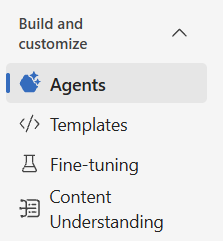
    </details>

14. (Microsoft Foundry) Select **New agent**.

    <details>
    <summary>Screenshot: Azure AI Foundry: New agent</summary>
    
    </details>

15. (Microsoft Foundry) In **Name**, enter `Lab1-<<STUDENT_ID>>`. The Student ID is your username. The Agent ID is set by default.

16. (Microsoft Foundry) In **Model deployment**, select `gpt-5-chat`.

17. (Microsoft Foundry) In **Instructions**, paste this text:

    `You are a compliance-first assistant. Use only the information in uploaded files and tool responses. If you don't have enough information, say you don't know.`

18. Select **Try in playground**.

    <details>
    <summary>Screenshot: Agent: Try in playground</summary>
    
    </details>

19. (Microsoft Foundry — Agent playground) In the chat box, send: `Confirm you are ready. Respond with only: READY`.

    <details>
    <summary>Screenshot: Azure AI Foundry: Agent playground</summary>
    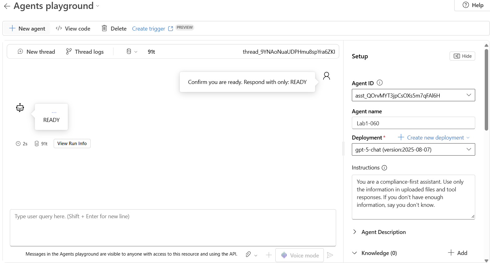
    </details>

20. (Microsoft Foundry — Agent playground) In the right-side **Setup** pane, under **Knowledge**, select **Add**.

    <details>
    <summary>Screenshot: Agent setup: add knowledge</summary>
    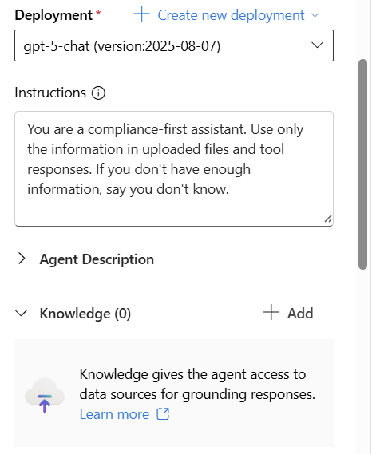
    </details>

21. (Prep) Confirm you have downloaded these files (you’ll upload them next):

    - https://raw.githubusercontent.com/LukeDuffy98/agentic-ai-fabric-workshop-student/refs/heads/main/assets/foundry/contoso-support-policy.md
    - https://raw.githubusercontent.com/LukeDuffy98/agentic-ai-fabric-workshop-student/refs/heads/main/assets/foundry/fabric_shift_constraints.md

22. (Microsoft Foundry — Agent playground) Select **Files**.

    <details>
    <summary>Screenshot: Knowledge: Files</summary>
    
    </details>

23. (Microsoft Foundry — Agent playground) Select **Select local files**.

    <details>
    <summary>Screenshot: Files knowledge: select local files</summary>
    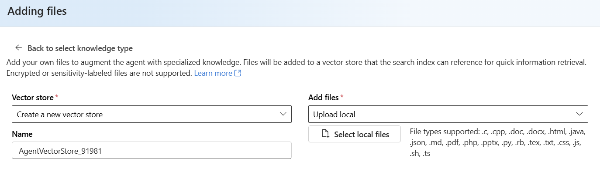
    </details>

24. (Microsoft Foundry — Agent playground) Select the file you downloaded named `contoso-support-policy.md`.

    <details>
    <summary>Screenshot: Upload contoso-support-policy.md</summary>
    
    </details>

25. (Microsoft Foundry — Agent playground) Select **Upload and save**.

26. (Microsoft Foundry — Agent playground) Select **Select local files**.

27. (Microsoft Foundry — Agent playground) Select the file you downloaded named `fabric_shift_constraints.md`.

28. (Microsoft Foundry — Agent playground) Select **Upload and save**.

29. (Microsoft Foundry — Agent playground) In the chat box, send: `Based only on the uploaded policy, list the three most important support rules. Use a 3-bullet list.`

    <details>
    <summary>Screenshot: Ask a grounded policy question</summary>
    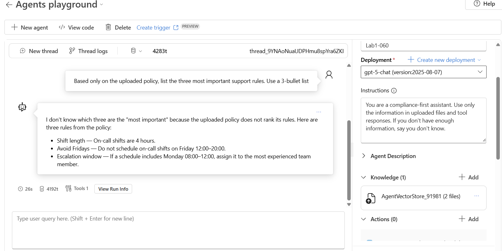
    </details>

30. Select **View run info**.

    <details>
    <summary>Screenshot: Agent run: view run info</summary>
    
    </details>

31. Notice the file search.

    <details>
    <summary>Screenshot: Run info: file search results</summary>
    
    </details>

32. (Thinking checkpoint) In your notes, answer these questions in 1–2 sentences each:

    - Where is your raw data source right now (in this lab), and how is it being used?
    - What is one way a model could answer incorrectly if it ignores the files?
    - From your job role, what would you ask to prove answers are grounded?

33. (Microsoft Foundry — Agent playground) Under **Knowledge**, select **Add**.

34. (Microsoft Foundry — Agent playground) Select **Microsoft Fabric**.

    <details>
    <summary>Screenshot: Knowledge: Microsoft Fabric</summary>
    
    </details>

35. (Microsoft Foundry — Agent playground) Select **Create connection**.

36. (Microsoft Foundry — Agent playground) In `workspace-id`, paste the value `2ca4cbdc-32a0-42ae-a79d-e16bc125eca1` from `<<FABRIC_DATA_AGENT_ENDPOINT_URL>>` between `/groups/` and `/aiskills/`.

37. (Microsoft Foundry — Agent playground) For `workspace-id`, select **is secret**.

38. (Microsoft Foundry — Agent playground) In `artifact-id`, paste the value `36678155-c9a9-45f8-a975-f104921ab812` from `<<FABRIC_DATA_AGENT_ENDPOINT_URL>>` after `/aiskills/`.

39. (Microsoft Foundry — Agent playground) For `artifact-id`, select **is secret**.

40. (Microsoft Foundry — Agent playground) In **Name**, enter `cn-<<STUDENT_ID>>`.

41. (Microsoft Foundry — Agent playground) Select **Connect**.

    <details>
    <summary>Screenshot: Create Fabric connection</summary>
    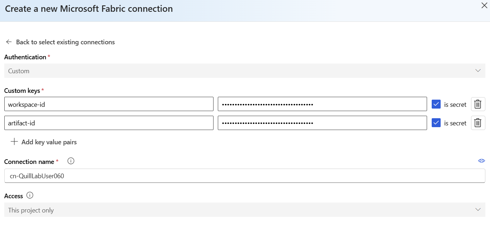
    </details>

42. (Microsoft Foundry — Agent playground) In **Instructions**, append this sentence:

    `For questions about business data, use the Microsoft Fabric tool.`

    <details>
    <summary>Screenshot: Update agent instructions</summary>
    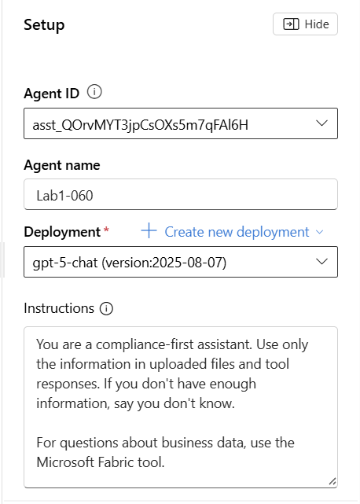
    </details>

43. (Optional, facilitator-led) If instructed, change **Deployment** to `gpt-4o`.

44. (Microsoft Foundry — Agent playground) In the chat box, send: `Use the Microsoft Fabric tool to retrieve one small factual result from the connected data agent. Then summarize it in one sentence.`

    <details>
    <summary>Screenshot: Prompt to use Fabric tool</summary>
    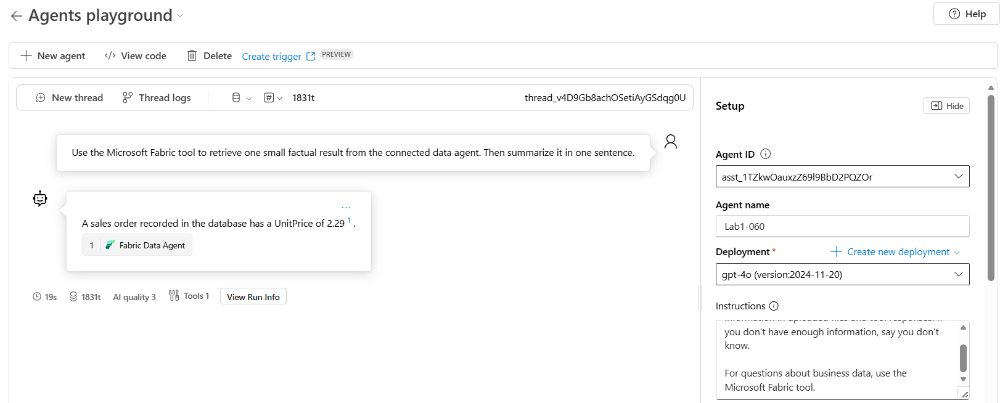
    </details>

45. (Thinking checkpoint) In your notes, answer these questions in 1–2 sentences each:

    - What remote service did you connect to, and where did you enter the connection details?
    - What account or identity do you think is being used to access that remote service?
    - From your job role, what audit evidence would you want for tool calls?

46. (Microsoft Foundry — Agent playground) Under **Actions**, select **Add**.

    <details>
    <summary>Screenshot: Actions: add action</summary>
    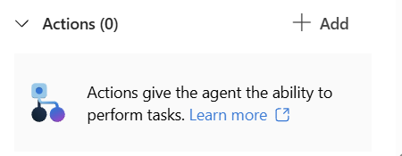
    </details>

47. (Microsoft Foundry — Agent playground) Select **Azure Logic Apps**.

    <details>
    <summary>Screenshot: Actions: Azure Logic Apps</summary>
    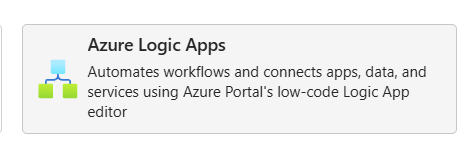
    </details>

    Note: If you do not see the workflow `la-20260205-agentic-ai` under **Your actions**, stop and ask your facilitator to confirm (1) you have **Reader** access to the resource group `2026-02-05-agentic-ai-us-fabric-rg`, and (2) the workflow is a **Consumption** logic app in the same subscription and resource group as this project, starts with **When an HTTP request is received** (with a **Description**), and ends with a **Response** action.

48. (Microsoft Foundry — Agent playground) Select the workflow named `la-20260205-agentic-ai`.

    <details>
    <summary>Screenshot: Logic Apps: select workflow</summary>
    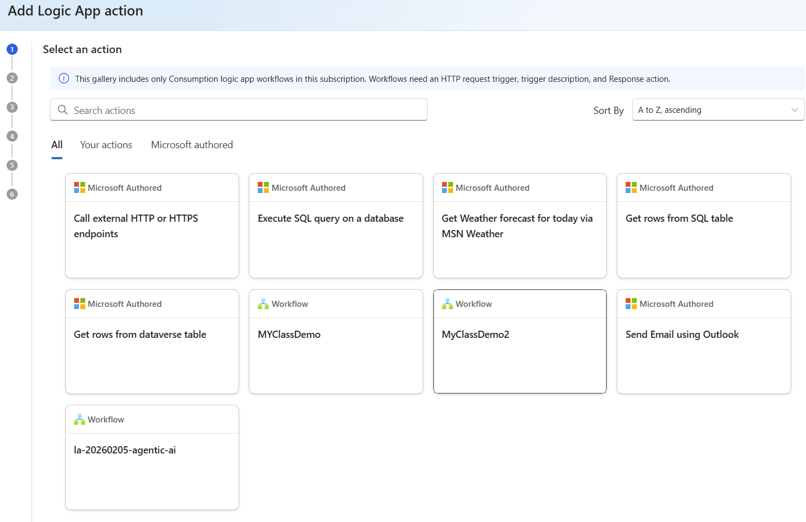
    </details>

49. (Microsoft Foundry — Agent playground) Select **Next**.

    <details>
    <summary>Screenshot: Logic Apps: Next</summary>
    
    </details>

50. (Microsoft Foundry — Agent playground) In **Describe how to invoke the tool**, enter the following:

    ```text
    Use this action only to write a single audit record to Azure Table Storage for this lab.
    Call this action when (and only when):
    - The user explicitly asks to “write an audit entry”, “log an audit record”, or “record completion/status” for the workshop.
    - You have the required fields: PartitionKey and RowKey.
    ```

    Then select **Create**.

    <details>
    <summary>Screenshot: Logic Apps: describe tool invocation</summary>
    
    </details>

51. (Microsoft Foundry — Agent playground) In the chat box, send:

    `Call the Azure Logic Apps action to write an audit entity to Azure Table storage. Use PartitionKey "lab1" and RowKey "<<STUDENT_ID>>". Include properties "scenario"="lab1" and "status"="created".`

52. (Thinking checkpoint) In your notes, answer these questions in 1–2 sentences each:

    - What action did the agent perform, and what system did it write to?
    - What data did you choose to write, and why is it safe (no PII/secrets)?
    - From your job role, what guardrail would prevent unintended writes?

53. (Browser) Open https://portal.azure.com/.

54. (Azure portal) Open the storage account named `sa20260205agenticai`.

    <details>
    <summary>Screenshot: Azure portal: storage account</summary>
    
    </details>

    <details>
    <summary>Screenshot: Azure portal: storage account overview</summary>
    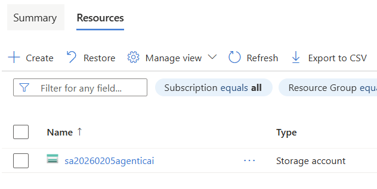
    </details>

55. (Azure portal) Select **Storage Browser**.

    <details>
    <summary>Screenshot: Azure portal: Storage browser</summary>
    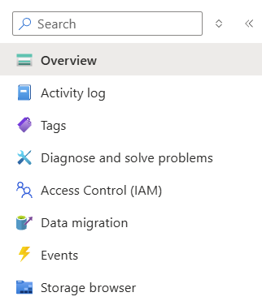
    </details>

56. (Azure portal) Select **Tables**.

    <details>
    <summary>Screenshot: Azure portal: tables</summary>
    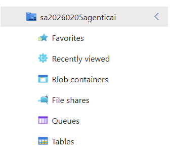
    </details>

57. (Azure portal) Select the table named `audit20260205`.

    <details>
    <summary>Screenshot: Azure portal: audit table</summary>
    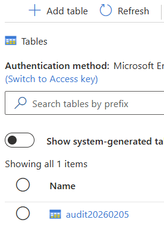
    </details>

58. (Azure portal) Find the entity with **PartitionKey** `lab1`.

59. (Azure portal) Confirm the entity has **RowKey** `<<STUDENT_ID>>`.

## Validation
- In Microsoft Foundry (classic), your agent exists and is named `Lab1-<<STUDENT_ID>>`.
- In Microsoft Foundry (classic), your agent has two uploaded files under **knowledge** and can answer a question grounded in those files.
- In Microsoft Foundry (classic), your agent run history shows at least one successful **Microsoft Fabric** tool call.
- In Microsoft Foundry (classic), your agent run history shows a successful **Azure Logic Apps** action call.
- In the Azure portal Storage Browser, the table `audit20260205` contains an entity with PartitionKey `lab1` and RowKey `<<STUDENT_ID>>`.

## Cleanup
1. (Microsoft Foundry) Select **Agents**.

2. (Microsoft Foundry) Select the agent `Lab1-<<STUDENT_ID>>`.

3. (Microsoft Foundry) Select **Delete**.

4. (Microsoft Foundry) Select **Delete**.

5. (Browser) Close the Azure portal tab.

## Compliance / safety notes
- Do not enter secrets, tokens, access keys, names, or emails in prompts.
- Use only your assigned `<<STUDENT_ID>>` as an identifier.
- Do not change model deployment settings, filters, or guardrails unless your facilitator instructs you to.

## References
- https://learn.microsoft.com/en-us/azure/ai-foundry/what-is-foundry?view=foundry-classic
- https://learn.microsoft.com/en-us/azure/ai-foundry/how-to/deploy-models-managed?view=foundry-classic#find-your-model-in-the-model-catalog
- https://learn.microsoft.com/en-us/azure/ai-foundry/openai/how-to/content-filters?view=foundry-classic#apply-a-content-filter
- https://learn.microsoft.com/en-us/azure/ai-foundry/foundry-models/how-to/use-blocklists?view=foundry-classic#create-a-blocklist
- https://learn.microsoft.com/en-us/azure/ai-foundry/agents/how-to/tools-classic/file-search-upload-files?view=foundry-classic
- https://learn.microsoft.com/en-us/azure/ai-foundry/agents/how-to/tools-classic/fabric?view=foundry-classic#setup
- https://learn.microsoft.com/en-us/azure/ai-foundry/agents/how-to/tools-classic/logic-apps?view=foundry-classic#add-a-logic-apps-workflow-to-an-agent-using-the-microsoft-foundry-portal
- https://learn.microsoft.com/en-us/azure/storage/tables/table-storage-quickstart-portal

