# Workshop end-to-end sketch


- Lab 1 focuses on building a Foundry (classic) agent with file grounding, a Fabric tool connection, and a Logic Apps action.
- Lab 2 focuses on building Fabric data, publishing a Fabric data agent, using Copilot in Power BI, and connecting that data agent to Foundry.

---

# Lab 2 — Build Fabric data and connect it to Copilot + Foundry

## Description
In this lab, you’ll create a Microsoft Fabric workspace and lakehouse, ingest the Northwind `Orders` dataset using Dataflow Gen2, and then publish a Fabric data agent over that lakehouse table. You’ll validate the data agent in Fabric, use it from Power BI Copilot, and connect it to a Foundry (classic) agent for data-backed answers.

## Learning outcomes
By the end of this lab, you can:
- Create a Fabric workspace and a lakehouse to isolate artifacts and data.
- Ingest the Northwind `Orders` table into a lakehouse table named `orders`.
- Create a Fabric data agent, query it, and publish it to obtain a published URL.
- Use the published data agent in Power BI Copilot for natural-language questions.
- Connect the published Fabric data agent to a Foundry (classic) agent and validate a successful tool call.

## Step-by-step
1. (Browser) Open a new InPrivate/Incognito window (for example, press Ctrl+Shift+N).

2. (Browser) Open https://app.fabric.microsoft.com/.

    If you’re prompted to start a trial, open the URL again.

    <details>
    <summary>Screenshot: Microsoft Fabric: home</summary>
    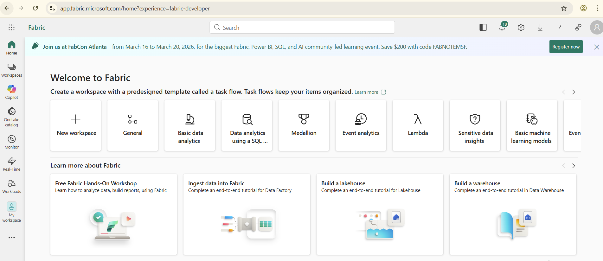
    </details>

3. (Microsoft Fabric) Select **New workspace**.

    <details>
    <summary>Screenshot: Fabric: New workspace</summary>
    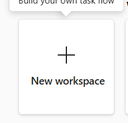
    </details>

4. (Microsoft Fabric) In **Name**, enter `Lab2_<<STUDENT_ID>>`.

    <details>
    <summary>Screenshot: Fabric: workspace name</summary>
    
    </details>

5. (Microsoft Fabric) Expand **Advanced**.

6. (Microsoft Fabric) In **License mode**, select **Fabric capacity**.

    <details>
    <summary>Screenshot: Fabric: license mode</summary>
    
    </details>

7. (Microsoft Fabric) In **Capacity**, select `fablabs`.

8. (Microsoft Fabric) Select **Apply**.

9. (Thinking checkpoint) In your notes, answer these questions in 1–2 sentences each:

    - What boundary are you creating with a workspace (people, data, artifacts)?
    - What control in these steps determines where compute runs (and costs accrue)?
    - From your job role, what would you ask before allowing a new workspace?

10. (Microsoft Fabric) In your workspace, select **New item**.

    <details>
    <summary>Screenshot: Fabric: New item</summary>
    
    </details>

11. (Microsoft Fabric) In the search box, enter `Lakehouse`.

12. (Microsoft Fabric) Select **Lakehouse**.

    <details>
    <summary>Screenshot: Fabric: select Lakehouse</summary>
    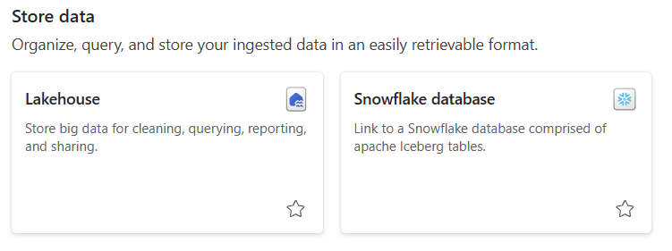
    </details>

13. (Microsoft Fabric) In the **New lakehouse** dialog, in **Name**, enter `lh_orders_<<STUDENT_ID>>`.

    <details>
    <summary>Screenshot: Fabric: lakehouse name</summary>
    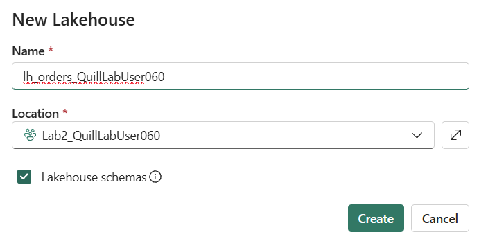
    </details>

14. (Microsoft Fabric) Select **Create**.

15. (Thinking checkpoint) In your notes, answer these questions in 1–2 sentences each:

    - What is the purpose of the lakehouse in this lab?
    - Where will your raw data land after ingestion (name the exact table target)?
    - From your job role, what is one data-quality risk to watch for?

16. (Microsoft Fabric) Select **Workspaces**.

17. (Microsoft Fabric) Select the workspace `Lab2_<<STUDENT_ID>>`.

    <details>
    <summary>Screenshot: Fabric: select Lab2 workspace</summary>
    
    </details>

    <details>
    <summary>Screenshot: Fabric: workspace home</summary>
    
    </details>

18. (Microsoft Fabric) Select **New item**.

19. (Microsoft Fabric) In the search box, enter `Dataflow Gen2`.

    <details>
    <summary>Screenshot: Fabric: search Dataflow Gen2</summary>
    
    </details>

20. (Microsoft Fabric) Select **Dataflow Gen2**.

21. (Microsoft Fabric) In the name prompt, enter `df_orders_<<STUDENT_ID>>`.

    <details>
    <summary>Screenshot: Dataflow Gen2: name the dataflow</summary>
    
    </details>

22. (Microsoft Fabric — Dataflow Gen2) Select the **Home** tab.

    <details>
    <summary>Screenshot: Dataflow Gen2: Home tab</summary>
    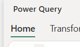
    </details>

23. (Microsoft Fabric — Dataflow Gen2) Select **Copilot**.

    <details>
    <summary>Screenshot: Dataflow Gen2: Copilot</summary>
    
    </details>

24. (Microsoft Fabric — Dataflow Gen2) Select **Get data from**.

    <details>
    <summary>Screenshot: Dataflow Gen2: Get data from</summary>
    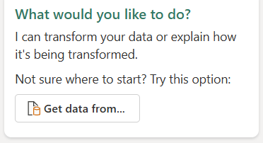
    </details>

25. (Microsoft Fabric — Get data) In the **Get data** window, search for `OData`.

    <details>
    <summary>Screenshot: Get data: search OData connector</summary>
    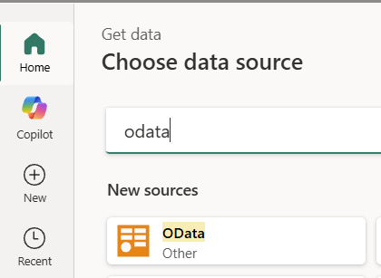
    </details>

26. (Microsoft Fabric — Get data) Select the **OData** connector.

27. (Microsoft Fabric — Connect to data source) In **URL**, paste this value:

    ```http
    https://services.odata.org/V4/Northwind/Northwind.svc/
    ```

28. (Microsoft Fabric — Connect to data source) Select **Next**.

    <details>
    <summary>Screenshot: OData: Next</summary>
    
    </details>

29. (Microsoft Fabric — Navigator) Select the **Orders** table.

30. (Microsoft Fabric — Navigator) Select **Create**.

    <details>
    <summary>Screenshot: Navigator: create Orders query</summary>
    
    </details>

31. (Microsoft Fabric — Dataflow Gen2) Select the query named **Orders**.

    <details>
    <summary>Screenshot: Dataflow: select Orders query</summary>
    
    </details>

32. (Microsoft Fabric — Dataflow Gen2) In the Copilot pane, select the starter prompt icon.

33. (Microsoft Fabric — Dataflow Gen2) Select **Describe this query**.

    <details>
    <summary>Screenshot: Copilot: Describe this query</summary>
    
    </details>

    <details>
    <summary>Screenshot: Copilot: query description output</summary>
    
    </details>

34. (Thinking checkpoint) In your notes, answer these questions in 1–2 sentences each:

    - What is your raw data source URL, and what is one risk of using it?
    - What did Copilot help you do here, and what did you still need to verify?
    - From your job role, what review/approval would you require before ingesting data from the internet?

35. (Microsoft Fabric — Dataflow Gen2) Select **Add data destination**.

    <details>
    <summary>Screenshot: Dataflow: add data destination</summary>
    
    </details>

36. (Microsoft Fabric — Dataflow Gen2) Select **Lakehouse**.

    <details>
    <summary>Screenshot: Destination: Lakehouse</summary>
    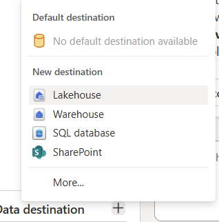
    </details>

37. (Microsoft Fabric — Connect to data destination) Select **Next**.

    <details>
    <summary>Screenshot: Destination: Next</summary>
    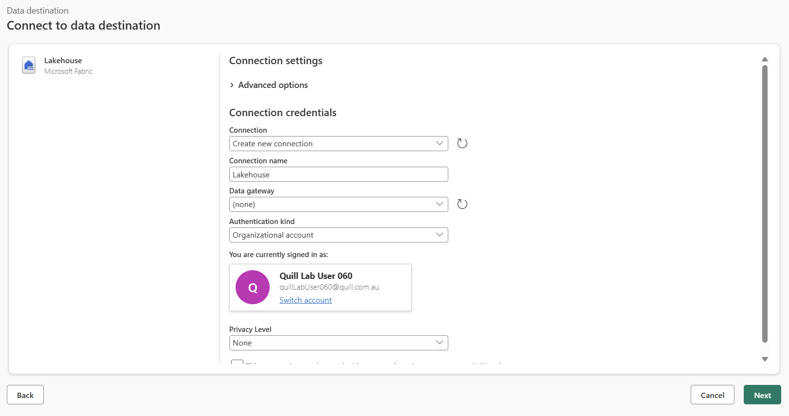
    </details>

38. (Microsoft Fabric — Choose destination target) Select the lakehouse `lh_orders_<<STUDENT_ID>>`.

39. (Microsoft Fabric — Choose destination target) In **New table name**, enter `orders`.

    <details>
    <summary>Screenshot: Destination: table name orders</summary>
    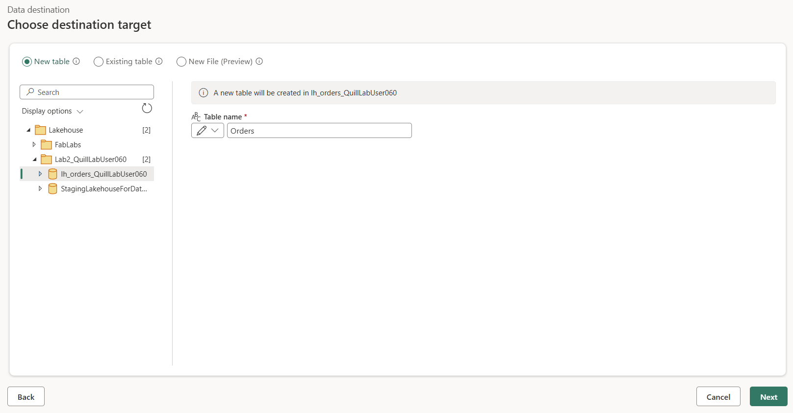
    </details>

40. (Microsoft Fabric — Choose destination target) Select **Next**.

41. (Microsoft Fabric — Choose destination settings) In **Update method**, deselect **Use automatic settings**, then select **Replace**.

    <details>
    <summary>Screenshot: Destination: update method Replace</summary>
    
    </details>

42. (Microsoft Fabric — Choose destination settings) Select **Save settings**.

43. (Microsoft Fabric — Dataflow Gen2) Select **Save and run**.

    <details>
    <summary>Screenshot: Dataflow: save and run</summary>
    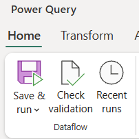
    </details>

44. (Microsoft Fabric) Wait until publishing completes and you return to the workspace. Check **Recent runs** to confirm.

45. (Microsoft Fabric) In the workspace item list, find `df_orders_<<STUDENT_ID>>`.

46. (Microsoft Fabric) Select the ellipsis (**...**) next to `df_orders_<<STUDENT_ID>>`.

47. (Microsoft Fabric) Select **Refresh now** (you may need to scroll).

    <details>
    <summary>Screenshot: Workspace: refresh now</summary>
    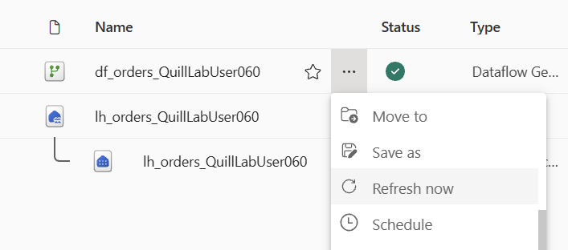
    </details>

48. (Microsoft Fabric) Wait for the refresh to finish.

49. (Microsoft Fabric) Open the lakehouse `lh_orders_<<STUDENT_ID>>`.

50. (Microsoft Fabric — Lakehouse) Select **Tables**.

51. (Microsoft Fabric — Lakehouse) Select the table `orders`. If you don’t see any tables, use **Refresh** and try again.

    <details>
    <summary>Screenshot: Lakehouse: orders table</summary>
    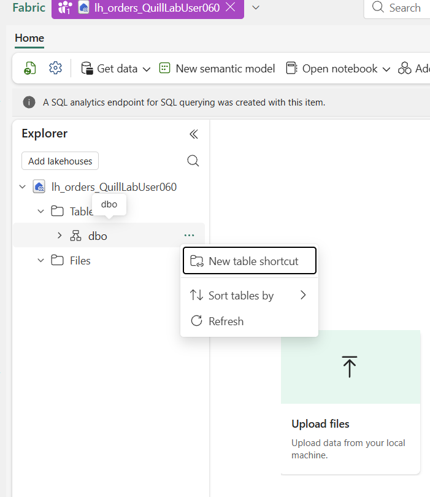
    </details>

    <details>
    <summary>Screenshot: Lakehouse: orders table data</summary>
    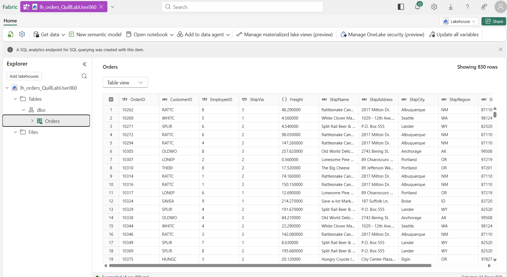
    </details>

52. (Thinking checkpoint) In your notes, answer these questions in 1–2 sentences each:

    - Where is your raw data now stored (name the workspace, lakehouse, and table)?
    - What does the **Replace** update method imply for data retention and audit?
    - From your job role, what lineage or monitoring would you require?

53. (Microsoft Fabric) Select **Workspaces**.

54. (Microsoft Fabric) Select the workspace `Lab2_<<STUDENT_ID>>`.

55. (Microsoft Fabric) Select **New item**.

56. (Microsoft Fabric) In the search box, enter `Data agent`.

    <details>
    <summary>Screenshot: Fabric: search Data agent</summary>
    
    </details>

57. (Microsoft Fabric) Select **Fabric data agent**.

58. (Microsoft Fabric) In the name prompt, enter `da_orders_<<STUDENT_ID>>`.

    <details>
    <summary>Screenshot: Data agent: name</summary>
    
    </details>

59. (Microsoft Fabric — Fabric data agent) Select **Add data**.

    <details>
    <summary>Screenshot: Data agent: add data</summary>
    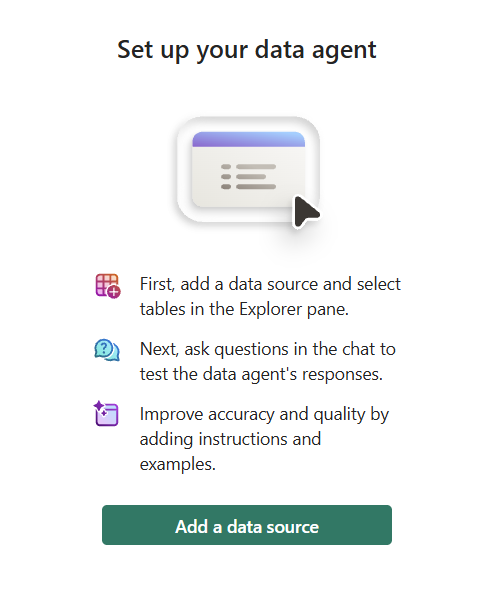
    </details>

60. (Microsoft Fabric — Fabric data agent) In the OneLake catalog, select the lakehouse `lh_orders_<<STUDENT_ID>>`.

    <details>
    <summary>Screenshot: OneLake: select lakehouse</summary>
    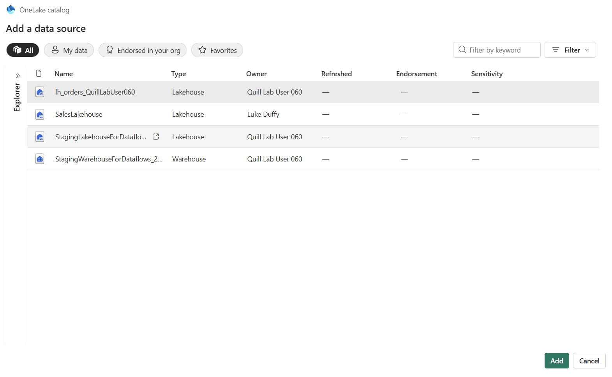
    </details>

61. (Microsoft Fabric — Fabric data agent) Select **Add**.

62. (Microsoft Fabric — Fabric data agent) In the left **Explorer** pane, select the lakehouse `lh_orders_<<STUDENT_ID>>`.

63. (Microsoft Fabric — Fabric data agent) Select the checkbox for the table `orders`.

    <details>
    <summary>Screenshot: OneLake: select orders table</summary>
    
    </details>

64. (Microsoft Fabric — Fabric data agent) In the chat area, send: `How many rows are in the orders table?`.

    <details>
    <summary>Screenshot: Data agent: ask for row count</summary>
    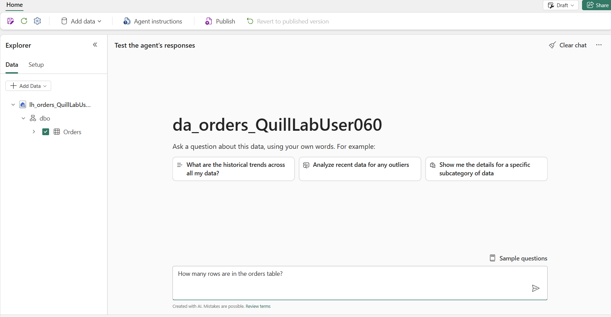
    </details>

    <details>
    <summary>Screenshot: Data agent: row count response</summary>
    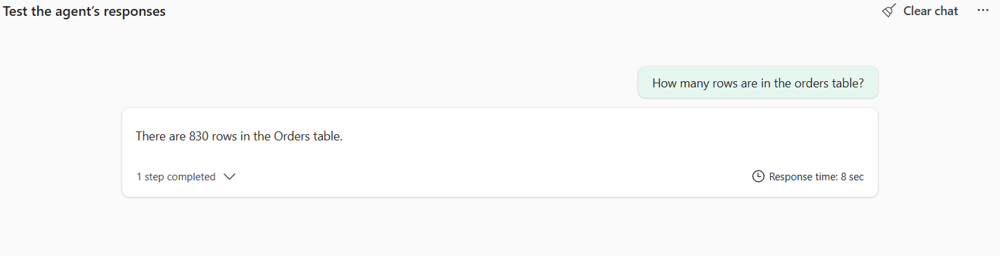
    </details>

65. (Microsoft Fabric — Fabric data agent) Select **Publish**.

    <details>
    <summary>Screenshot: Data agent: publish</summary>
    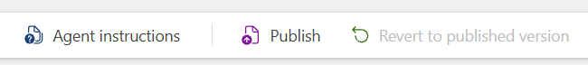
    </details>

66. (Microsoft Fabric — Publish data agent) Select **Publish**.

    <details>
    <summary>Screenshot: Data agent: confirm publish</summary>
    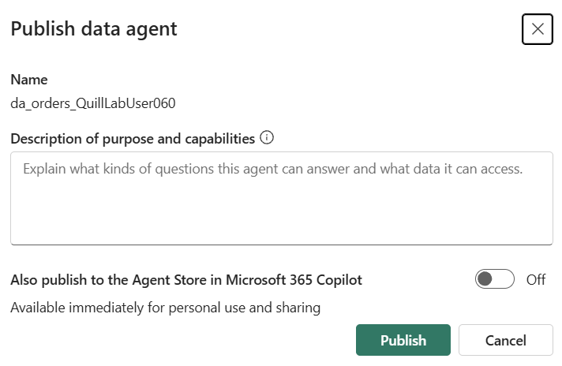
    </details>

67. (Microsoft Fabric — Publish data agent) Copy the **published URL** that appears.

    <details>
    <summary>Screenshot: Data agent: copy published URL</summary>
    
    </details>

68. (Optional) You can also access the published URL using the **Gear** icon.

    <details>
    <summary>Screenshot: Data agent: settings (gear icon)</summary>
    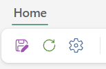
    </details>

69. (Thinking checkpoint) In your notes, answer these questions in 1–2 sentences each:

    - What is being exposed by publishing the data agent (and what is not)?
    - Who should be allowed to query this data agent in a real organization?
    - From your job role, what is one guardrail you would require for this capability?

70. (Browser) Open https://app.powerbi.com/.

71. (Power BI) In the left navigation, select **Copilot**.

    <details>
    <summary>Screenshot: Power BI: Copilot</summary>
    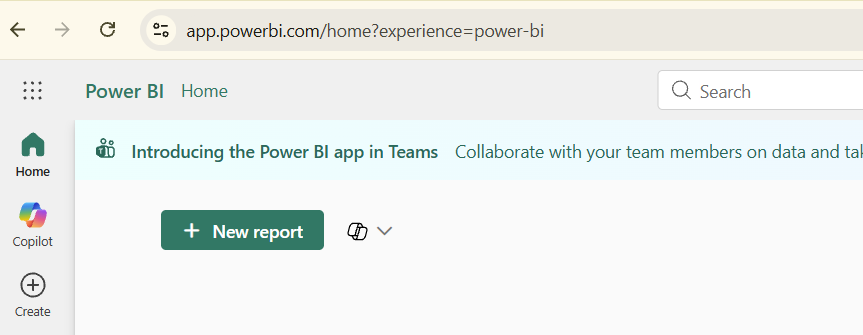
    </details>

72. (Power BI — Copilot) In the chat box, select **Add items for better results** (the plus icon).

73. (Power BI — Select items) Select **Data agents**.

74. (Power BI — Select data agent) Select `da_orders_<<STUDENT_ID>>`.

    <details>
    <summary>Screenshot: Power BI: select data agent</summary>
    
    </details>

75. (Power BI — Copilot) Send: `How many rows are in the orders table?`.

    <details>
    <summary>Screenshot: Power BI Copilot: ask row count</summary>
    
    </details>

    <details>
    <summary>Screenshot: Power BI Copilot: row count result</summary>
    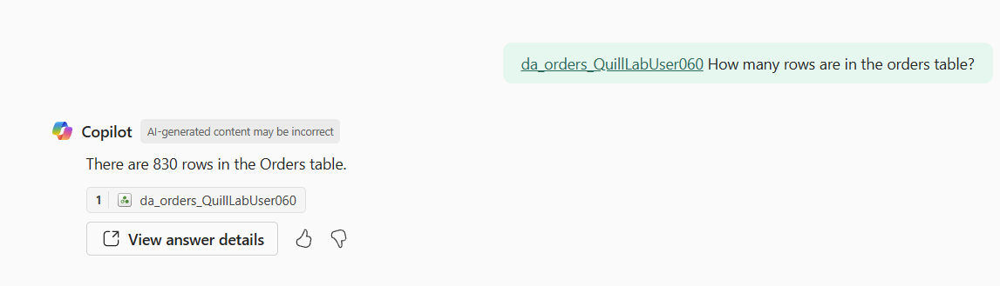
    </details>

76. (Power BI — Copilot) Send: `Show the top 5 ship countries by number of orders.`.

    <details>
    <summary>Screenshot: Power BI Copilot: top ship countries</summary>
    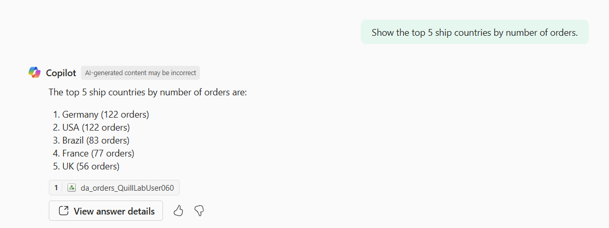
    </details>

77. (Thinking checkpoint) In your notes, answer these questions in 1–2 sentences each:

    - What would you do to validate Copilot’s answer (without trusting it blindly)?
    - Where do you see guardrails in this experience (or where would you expect them)?
    - From your job role, what would make you comfortable using Copilot for business decisions?

78. (Browser) Open https://ai.azure.com/.

79. (Microsoft Foundry) Set the **New Foundry** toggle to **Off**.

80. (Microsoft Foundry) Select your project named `2026-02-05-agentic-ai`.

81. (Microsoft Foundry) Select **Agents**.

82. (Microsoft Foundry) Select **Create an agent**.

83. (Microsoft Foundry) In **Name**, enter `Lab2-<<STUDENT_ID>>`.

84. (Microsoft Foundry) In **Model deployment**, select `gpt-5-chat`.

85. (Microsoft Foundry) Select **Create**.

86. (Microsoft Foundry — Agent playground) In **Instructions**, paste this text:

    `You are a compliance-first assistant. Use the Microsoft Fabric tool for questions about the orders dataset in the connected Fabric data agent. If you don't have enough information, say you don't know.`

87. (Microsoft Foundry — Agent playground) In the right-side **Setup** pane, under **knowledge**, select **Add**.

88. (Microsoft Foundry — Agent playground) Select **Microsoft Fabric**.

89. (Microsoft Foundry — Agent playground) Select **Add connection**.

90. (Microsoft Foundry — Agent playground) In `workspace-id`, paste the value from your published URL between `/groups/` and `/aiskills/`.

91. (Microsoft Foundry — Agent playground) For `workspace-id`, select **is secret**.

92. (Microsoft Foundry — Agent playground) In `artifact-id`, paste the value from your published URL after `/aiskills/`.

93. (Microsoft Foundry — Agent playground) For `artifact-id`, select **is secret**.

94. (Microsoft Foundry — Agent playground) Select **Save**.

95. (Microsoft Foundry — Agent playground) In the chat box, send: `Use the Microsoft Fabric tool to answer: How many rows are in the orders table?`.

96. (Thinking checkpoint) In your notes, answer these questions in 1–2 sentences each:

    - What remote service is your Foundry agent connected to now?
    - What account or identity do you think is used when the tool runs?
    - From your job role, what is one control you would require before letting an agent query enterprise data?

## Validation
- In Fabric, the workspace `Lab2_<<STUDENT_ID>>` exists and contains:
  - The lakehouse `lh_orders_<<STUDENT_ID>>`.
  - The table `orders`.
  - The Fabric data agent `da_orders_<<STUDENT_ID>>`.
- In Power BI Copilot, you can add `da_orders_<<STUDENT_ID>>` and receive an answer to a question about `orders`.
- In Foundry (classic), `Lab2-<<STUDENT_ID>>` exists and its run history shows a successful Microsoft Fabric tool call.

## Cleanup
1. (Microsoft Foundry) Select **Agents**.

2. (Microsoft Foundry) Select the agent `Lab2-<<STUDENT_ID>>`.

3. (Microsoft Foundry) Select **Delete**.

4. (Microsoft Foundry) Select **Delete**.

5. (Microsoft Fabric) Open https://app.fabric.microsoft.com.

6. (Microsoft Fabric) Select **Workspaces**.

7. (Microsoft Fabric) Select the workspace `Lab2_<<STUDENT_ID>>`.

8. (Microsoft Fabric) Select **Workspace settings**.

9. (Microsoft Fabric) Select **Delete this workspace**.

10. (Microsoft Fabric) Select **Delete**.

## Compliance / safety notes
- Do not enter secrets, tokens, access keys, names, or emails in prompts.
- Use only your assigned `<<STUDENT_ID>>` as an identifier.

## References
- https://learn.microsoft.com/en-us/fabric/fundamentals/create-workspaces
- https://learn.microsoft.com/en-us/fabric/data-engineering/tutorial-build-lakehouse#create-a-lakehouse
- https://learn.microsoft.com/en-us/fabric/data-factory/tutorial-dataflows-gen2-pipeline-activity
- https://learn.microsoft.com/en-us/fabric/data-factory/copilot-fabric-data-factory-get-started#get-started-with-copilot-for-dataflow-gen2
- https://learn.microsoft.com/en-us/fabric/data-science/how-to-create-data-agent
- https://learn.microsoft.com/en-us/fabric/data-science/data-agent-end-to-end-tutorial
- https://learn.microsoft.com/en-us/power-bi/create-reports/copilot-introduction
- https://learn.microsoft.com/en-us/azure/ai-foundry/agents/how-to/tools-classic/fabric?view=foundry-classic#setup
