# Lab 1 — Explore Microsoft Foundry (classic) and build an agent with knowledge + actions

## Learning objectives
- Confirm you are using Microsoft Foundry (classic) and can navigate the key areas.
- Create an agent and iteratively improve it using clear instructions.
- Add **Files** knowledge and validate grounded answers from uploaded policy content.
- Add a pre-provisioned **Microsoft Fabric** data agent connection and validate a successful tool call.
- Add a pre-provisioned **Azure Logic Apps** action and validate that it writes an entity to an Azure Storage Table.

## Prereqs
- You have a web browser and you can sign in with your lab account.
- Your facilitator provides these exact values:
  - **Foundry project name:** `<<FOUNDRY_PROJECT_NAME>>`
  - **Model deployment name:** `<<MODEL_DEPLOYMENT_NAME>>`
  - **Your student ID (no names/emails):** `<<STUDENT_ID>>` (example format: `student-07`)
  - **Fabric data agent endpoint URL:** `<<FABRIC_DATA_AGENT_ENDPOINT_URL>>` (format: `https://<environment>.fabric.microsoft.com/groups/<workspace_id>/aiskills/<artifact-id>`)
  - **Logic App workflow name:** `<<LOGIC_APP_WORKFLOW_NAME>>`
  - **Storage account name:** `<<STORAGE_ACCOUNT_NAME>>`
  - **Storage table name:** `<<STORAGE_TABLE_NAME>>`

- Your facilitator has already prepared these resources (students do not create Azure resources in this lab):
  - A Microsoft Foundry project with a model deployment named `<<MODEL_DEPLOYMENT_NAME>>`.
  - A published Microsoft Fabric data agent (you will use its published endpoint URL).
  - An Azure Logic Apps **Consumption** workflow that:
    - Is in the same subscription and resource group as the Foundry project.
    - Starts with a **Request** trigger (with a description).
    - Ends with a **Response** action.
    - Writes an entity to the table `<<STORAGE_TABLE_NAME>>` in storage account `<<STORAGE_ACCOUNT_NAME>>`.
  - An Azure Storage account that contains a table named `<<STORAGE_TABLE_NAME>>`.

- Required permissions (least privilege):
  - On the Foundry project: **Azure AI Developer**.
  - On the project’s storage account (for file uploads): **Storage Blob Data Contributor**.
  - On the storage account (for validation in the Azure portal): **Storage Table Data Reader**.

- Download these two files to your computer (you will upload them in Foundry):
    - [assets/foundry/contoso-support-policy.md](../assets/foundry/contoso-support-policy.md)
    - [assets/foundry/fabric_shift_constraints.md](../assets/foundry/fabric_shift_constraints.md)
- For each file link, right-click the link and select **Save link as...**, then save the file to a folder you can find.

## Estimated time
90–120 minutes

## Architecture sketch


- A Foundry (classic) agent answers questions and uses knowledge/tools.
- File knowledge provides policy grounding from local markdown files.
- A Fabric data agent is connected as a knowledge tool for data-backed answers.
- A Logic App is connected as an action to write an audit entity to Azure Table storage.

## Step-by-step
1. (Browser) Open https://ai.azure.com/.

2. (Microsoft Foundry) Set the **New Foundry** toggle to **Off**.

3. (Microsoft Foundry) Select your project named `<<FOUNDRY_PROJECT_NAME>>`.

4. (Microsoft Foundry) Select **Model catalog**.

5. (Microsoft Foundry) Select **Models + endpoints**.

6. (Microsoft Foundry) Select the deployment named `<<MODEL_DEPLOYMENT_NAME>>`.

7. (Microsoft Foundry) Select **Edit**.

8. (Microsoft Foundry) Select **Cancel**.

9. (Microsoft Foundry) Select **Guardrails + controls**.

10. (Microsoft Foundry) Select the **Content filters** tab.

11. (Microsoft Foundry) Select the **Blocklists** tab.

12. (Thinking checkpoint) In your notes, answer these questions in 1–2 sentences each:

    - What controls exist in Foundry so far, and who should own them?
    - Where are the guardrails you just viewed, and what risk do they reduce?
    - From your job role, what is one control you would require before production use?

13. (Microsoft Foundry) Select **Agents**.

14. (Microsoft Foundry) Select **Create an agent**.

15. (Microsoft Foundry) In **Name**, enter `Lab1-<<STUDENT_ID>>`.

16. (Microsoft Foundry) In **Model deployment**, select `<<MODEL_DEPLOYMENT_NAME>>`.

17. (Microsoft Foundry) Select **Create**.

18. (Microsoft Foundry — Agent playground) In **Instructions**, paste this text:

    `You are a compliance-first assistant. Use only the information in uploaded files and tool responses. If you don't have enough information, say you don't know.`

19. (Microsoft Foundry — Agent playground) In the chat box, send: `Confirm you are ready. Respond with only: READY`.

20. (Microsoft Foundry — Agent playground) In the right-side **Setup** pane, under **knowledge**, select **Add**.

21. (Microsoft Foundry — Agent playground) Select **Files**.

22. (Microsoft Foundry — Agent playground) Select **Select local files**.

23. (Microsoft Foundry — Agent playground) Select the file you downloaded named `contoso-support-policy.md`.

24. (Microsoft Foundry — Agent playground) Select **Upload and save**.

25. (Microsoft Foundry — Agent playground) Select **Select local files**.

26. (Microsoft Foundry — Agent playground) Select the file you downloaded named `fabric_shift_constraints.md`.

27. (Microsoft Foundry — Agent playground) Select **Upload and save**.

28. (Microsoft Foundry — Agent playground) In the chat box, send: `Based only on the uploaded policy, list the three most important support rules. Use a 3-bullet list.`

29. (Thinking checkpoint) In your notes, answer these questions in 1–2 sentences each:

    - Where is your raw data source right now (in this lab), and how is it being used?
    - What is one way a model could answer incorrectly if it ignores the files?
    - From your job role, what would you ask to prove answers are grounded?

30. (Microsoft Foundry — Agent playground) Under **knowledge**, select **Add**.

31. (Microsoft Foundry — Agent playground) Select **Microsoft Fabric**.

32. (Microsoft Foundry — Agent playground) Select **Add connection**.

33. (Microsoft Foundry — Agent playground) In `workspace-id`, paste the value from `<<FABRIC_DATA_AGENT_ENDPOINT_URL>>` between `/groups/` and `/aiskills/`.

34. (Microsoft Foundry — Agent playground) For `workspace-id`, select **is secret**.

35. (Microsoft Foundry — Agent playground) In `artifact-id`, paste the value from `<<FABRIC_DATA_AGENT_ENDPOINT_URL>>` after `/aiskills/`.

36. (Microsoft Foundry — Agent playground) For `artifact-id`, select **is secret**.

37. (Microsoft Foundry — Agent playground) Select **Save**.

38. (Microsoft Foundry — Agent playground) In **Instructions**, append this sentence:

    `For questions about business data, use the Microsoft Fabric tool.`

39. (Microsoft Foundry — Agent playground) In the chat box, send: `Use the Microsoft Fabric tool to retrieve one small factual result from the connected data agent. Then summarize it in one sentence.`

40. (Thinking checkpoint) In your notes, answer these questions in 1–2 sentences each:

    - What remote service did you connect to, and where did you enter the connection details?
    - What account or identity do you think is being used to access that remote service?
    - From your job role, what audit evidence would you want for tool calls?

41. (Microsoft Foundry — Agent playground) Under **Actions**, select **Add**.

42. (Microsoft Foundry — Agent playground) Select **Azure Logic Apps**.

43. (Microsoft Foundry — Agent playground) Select the workflow named `<<LOGIC_APP_WORKFLOW_NAME>>`.

44. (Microsoft Foundry — Agent playground) Select **Add**.

45. (Microsoft Foundry — Agent playground) In the chat box, send:

    `Call the Azure Logic Apps action to write an audit entity to Azure Table storage. Use PartitionKey "lab1" and RowKey "<<STUDENT_ID>>". Include properties "scenario"="lab1" and "status"="created".`

46. (Thinking checkpoint) In your notes, answer these questions in 1–2 sentences each:

    - What action did the agent perform, and what system did it write to?
    - What data did you choose to write, and why is it safe (no PII/secrets)?
    - From your job role, what guardrail would prevent unintended writes?

47. (Browser) Open https://portal.azure.com/.

48. (Azure portal) Open the storage account named `<<STORAGE_ACCOUNT_NAME>>`.

49. (Azure portal) Select **Storage Browser**.

50. (Azure portal) Select **Tables**.

51. (Azure portal) Select the table named `<<STORAGE_TABLE_NAME>>`.

52. (Azure portal) Find the entity with **PartitionKey** `lab1`.

53. (Azure portal) Confirm the entity has **RowKey** `<<STUDENT_ID>>`.

## Validation
- In Microsoft Foundry (classic), your agent exists and is named `Lab1-<<STUDENT_ID>>`.
- In Microsoft Foundry (classic), your agent has two uploaded files under **knowledge** and can answer a question grounded in those files.
- In Microsoft Foundry (classic), your agent run history shows at least one successful **Microsoft Fabric** tool call.
- In Microsoft Foundry (classic), your agent run history shows a successful **Azure Logic Apps** action call.
- In the Azure portal Storage Browser, the table `<<STORAGE_TABLE_NAME>>` contains an entity with PartitionKey `lab1` and RowKey `<<STUDENT_ID>>`.

## Cleanup
1. (Microsoft Foundry) Select **Agents**.

2. (Microsoft Foundry) Select the agent `Lab1-<<STUDENT_ID>>`.

3. (Microsoft Foundry) Select **Delete**.

4. (Microsoft Foundry) Select **Delete**.

5. (Browser) Close the Azure portal tab.

## Compliance / safety notes
- Do not enter secrets, tokens, access keys, names, or emails in prompts.
- Use only your assigned `<<STUDENT_ID>>` as an identifier.
- Do not change model deployment settings, filters, or guardrails unless your facilitator instructs you to.

## References
- https://learn.microsoft.com/en-us/azure/ai-foundry/what-is-foundry?view=foundry-classic
- https://learn.microsoft.com/en-us/azure/ai-foundry/how-to/deploy-models-managed?view=foundry-classic#find-your-model-in-the-model-catalog
- https://learn.microsoft.com/en-us/azure/ai-foundry/openai/how-to/content-filters?view=foundry-classic#apply-a-content-filter
- https://learn.microsoft.com/en-us/azure/ai-foundry/foundry-models/how-to/use-blocklists?view=foundry-classic#create-a-blocklist
- https://learn.microsoft.com/en-us/azure/ai-foundry/agents/how-to/tools-classic/file-search-upload-files?view=foundry-classic
- https://learn.microsoft.com/en-us/azure/ai-foundry/agents/how-to/tools-classic/fabric?view=foundry-classic#setup
- https://learn.microsoft.com/en-us/azure/ai-foundry/agents/how-to/tools-classic/logic-apps?view=foundry-classic#add-a-logic-apps-workflow-to-an-agent-using-the-microsoft-foundry-portal
- https://learn.microsoft.com/en-us/azure/storage/tables/table-storage-quickstart-portal

---

# Lab 2 — Build Fabric lakehouse data with Dataflow Gen2 + Copilot, then connect it to a Foundry agent

## Learning objectives
- Create a Microsoft Fabric workspace and lakehouse.
- Use Dataflow Gen2 to ingest data from a URL into a lakehouse table.
- Use Copilot in Dataflow Gen2 to assist with ingest/transform steps.
- Create and publish a Fabric data agent over the lakehouse table.
- Use Copilot in Power BI to chat with the Fabric data agent.
- Connect the published Fabric data agent to a Microsoft Foundry (classic) agent using the Microsoft Fabric tool.

## Prereqs
- You have a web browser and you can sign in with your lab account.
- Your facilitator provides these exact values:
  - **Foundry project name:** `<<FOUNDRY_PROJECT_NAME>>`
  - **Model deployment name:** `<<MODEL_DEPLOYMENT_NAME>>`
  - **Your student ID (no names/emails):** `<<STUDENT_ID>>` (example format: `student-07`)
  - **Fabric capacity name:** `<<FABRIC_CAPACITY_NAME>>`

- Your facilitator has already confirmed these tenant prerequisites (students do not change tenant settings):
  - Copilot is enabled for Fabric.
  - Copilot is enabled for Power BI, including the standalone Copilot experience.
  - Fabric data agents are enabled in the tenant.

## Estimated time
60–90 minutes

## Architecture sketch


- You ingest sample data into a Fabric Lakehouse table using Dataflow Gen2.
- You create a Fabric data agent over that lakehouse table and publish it.
- You chat with the data agent in Copilot in Power BI.
- You connect the published Fabric data agent to a Foundry (classic) agent using the Microsoft Fabric tool.

## Step-by-step
1. (Browser) Open https://app.fabric.microsoft.com.

2. (Microsoft Fabric) In the left navigation, select **Workspaces**.

3. (Microsoft Fabric) Select **New workspace**.

4. (Microsoft Fabric) In **Name**, enter `Lab2_<<STUDENT_ID>>`.

5. (Microsoft Fabric) Expand **Advanced**.

6. (Microsoft Fabric) In **License mode**, select **Fabric capacity**.

7. (Microsoft Fabric) In **Capacity**, select `<<FABRIC_CAPACITY_NAME>>`.

8. (Microsoft Fabric) Select **Apply**.

9. (Thinking checkpoint) In your notes, answer these questions in 1–2 sentences each:

    - What boundary are you creating with a workspace (people, data, artifacts)?
    - What control in these steps determines where compute runs (and costs accrue)?
    - From your job role, what would you ask before allowing a new workspace?

10. (Microsoft Fabric) In your workspace, select **New item**.

11. (Microsoft Fabric) In the search box, enter `Lakehouse`.

12. (Microsoft Fabric) Select **Lakehouse**.

13. (Microsoft Fabric) In the **New lakehouse** dialog, in **Name**, enter `lh_orders_<<STUDENT_ID>>`.

14. (Microsoft Fabric) Select **Create**.

15. (Thinking checkpoint) In your notes, answer these questions in 1–2 sentences each:

    - What is the purpose of the lakehouse in this lab?
    - Where will your raw data land after ingestion (name the exact table target)?
    - From your job role, what is one data-quality risk to watch for?

16. (Microsoft Fabric) Select **Workspaces**.

17. (Microsoft Fabric) Select the workspace `Lab2_<<STUDENT_ID>>`.

18. (Microsoft Fabric) Select **New item**.

19. (Microsoft Fabric) In the search box, enter `Dataflow Gen2`.

20. (Microsoft Fabric) Select **Dataflow Gen2**.

21. (Microsoft Fabric) In the name prompt, enter `df_orders_<<STUDENT_ID>>`.

22. (Microsoft Fabric — Dataflow Gen2) Select the **Home** tab.

23. (Microsoft Fabric — Dataflow Gen2) Select **Copilot**.

24. (Microsoft Fabric — Dataflow Gen2) In the bottom-left of the Copilot pane, select the starter prompt icon.

25. (Microsoft Fabric — Dataflow Gen2) Select **Get data from**.

26. (Microsoft Fabric — Get data) In the **Get data** window, search for `OData`.

27. (Microsoft Fabric — Get data) Select the **OData** connector.

28. (Microsoft Fabric — Connect to data source) In **URL**, paste this value:

    ```http
    https://services.odata.org/V4/Northwind/Northwind.svc/
    ```

29. (Microsoft Fabric — Connect to data source) Select **Next**.

30. (Microsoft Fabric — Navigator) Select the **Orders** table.

31. (Microsoft Fabric — Navigator) Select **Create**.

32. (Microsoft Fabric — Dataflow Gen2) Select the query named **Orders**.

33. (Microsoft Fabric — Dataflow Gen2) In the Copilot pane, select the starter prompt icon.

34. (Microsoft Fabric — Dataflow Gen2) Select **Describe this query**.

35. (Thinking checkpoint) In your notes, answer these questions in 1–2 sentences each:

    - What is your raw data source URL, and what is one risk of using it?
    - What did Copilot help you do here, and what did you still need to verify?
    - From your job role, what review/approval would you require before ingesting data from the internet?

36. (Microsoft Fabric — Dataflow Gen2) Select **Add data destination**.

37. (Microsoft Fabric — Dataflow Gen2) Select **Lakehouse**.

38. (Microsoft Fabric — Connect to data destination) Select **Next**.

39. (Microsoft Fabric — Choose destination target) Select the lakehouse `lh_orders_<<STUDENT_ID>>`.

40. (Microsoft Fabric — Choose destination target) In **New table name**, enter `orders`.

41. (Microsoft Fabric — Choose destination target) Select **Next**.

42. (Microsoft Fabric — Choose destination settings) In **Update method**, select **Replace**.

43. (Microsoft Fabric — Choose destination settings) Select **Save settings**.

44. (Microsoft Fabric — Dataflow Gen2) Select **Publish**.

45. (Microsoft Fabric) Wait until publishing completes and you return to the workspace.

46. (Microsoft Fabric) In the workspace item list, find `df_orders_<<STUDENT_ID>>`.

47. (Microsoft Fabric) Select the ellipsis (**...**) next to `df_orders_<<STUDENT_ID>>`.

48. (Microsoft Fabric) Select **Refresh now**.

49. (Microsoft Fabric) Wait for the refresh to finish.

50. (Microsoft Fabric) Open the lakehouse `lh_orders_<<STUDENT_ID>>`.

51. (Microsoft Fabric — Lakehouse) Select **Tables**.

52. (Microsoft Fabric — Lakehouse) Select the table `orders`.

53. (Thinking checkpoint) In your notes, answer these questions in 1–2 sentences each:

    - Where is your raw data now stored (name the workspace, lakehouse, and table)?
    - What does the **Replace** update method imply for data retention and audit?
    - From your job role, what lineage or monitoring would you require?

54. (Microsoft Fabric) Select **Workspaces**.

55. (Microsoft Fabric) Select the workspace `Lab2_<<STUDENT_ID>>`.

56. (Microsoft Fabric) Select **New item**.

57. (Microsoft Fabric) In the search box, enter `Fabric data agent`.

58. (Microsoft Fabric) Select **Fabric data agent**.

59. (Microsoft Fabric) In the name prompt, enter `da_orders_<<STUDENT_ID>>`.

60. (Microsoft Fabric — Fabric data agent) In the OneLake catalog, select the lakehouse `lh_orders_<<STUDENT_ID>>`.

61. (Microsoft Fabric — Fabric data agent) Select **Add**.

62. (Microsoft Fabric — Fabric data agent) In the left **Explorer** pane, select the lakehouse `lh_orders_<<STUDENT_ID>>`.

63. (Microsoft Fabric — Fabric data agent) Select the checkbox for the table `orders`.

64. (Microsoft Fabric — Fabric data agent) In the chat area, send: `How many rows are in the orders table?`.

65. (Microsoft Fabric — Fabric data agent) Select **Publish**.

66. (Microsoft Fabric — Publish data agent) Select **Publish**.

67. (Microsoft Fabric — Publish data agent) Copy the **published URL** that appears.

68. (Thinking checkpoint) In your notes, answer these questions in 1–2 sentences each:

    - What is being exposed by publishing the data agent (and what is not)?
    - Who should be allowed to query this data agent in a real organization?
    - From your job role, what is one guardrail you would require for this capability?

69. (Browser) Open https://app.powerbi.com/.

70. (Power BI) In the left navigation, select **Copilot**.

71. (Power BI — Copilot) In the chat box, select **Add items for better results**.

72. (Power BI — Select items) Select **Data agents**.

73. (Power BI — Select data agent) Select `da_orders_<<STUDENT_ID>>`.

74. (Power BI — Select data agent) Select **Confirm**.

75. (Power BI — Copilot) Send: `How many rows are in the orders table?`.

76. (Power BI — Copilot) Send: `Show the top 5 ship countries by number of orders.`.

77. (Thinking checkpoint) In your notes, answer these questions in 1–2 sentences each:

    - What would you do to validate Copilot’s answer (without trusting it blindly)?
    - Where do you see guardrails in this experience (or where would you expect them)?
    - From your job role, what would make you comfortable using Copilot for business decisions?

78. (Browser) Open https://ai.azure.com/.

79. (Microsoft Foundry) Set the **New Foundry** toggle to **Off**.

80. (Microsoft Foundry) Select your project named `<<FOUNDRY_PROJECT_NAME>>`.

81. (Microsoft Foundry) Select **Agents**.

82. (Microsoft Foundry) Select **Create an agent**.

83. (Microsoft Foundry) In **Name**, enter `Lab2-<<STUDENT_ID>>`.

84. (Microsoft Foundry) In **Model deployment**, select `<<MODEL_DEPLOYMENT_NAME>>`.

85. (Microsoft Foundry) Select **Create**.

86. (Microsoft Foundry — Agent playground) In **Instructions**, paste this text:

    `You are a compliance-first assistant. Use the Microsoft Fabric tool for questions about the orders dataset in the connected Fabric data agent. If you don't have enough information, say you don't know.`

87. (Microsoft Foundry — Agent playground) In the right-side **Setup** pane, under **knowledge**, select **Add**.

88. (Microsoft Foundry — Agent playground) Select **Microsoft Fabric**.

89. (Microsoft Foundry — Agent playground) Select **Add connection**.

90. (Microsoft Foundry — Agent playground) In `workspace-id`, paste the value from your published URL between `/groups/` and `/aiskills/`.

91. (Microsoft Foundry — Agent playground) For `workspace-id`, select **is secret**.

92. (Microsoft Foundry — Agent playground) In `artifact-id`, paste the value from your published URL after `/aiskills/`.

93. (Microsoft Foundry — Agent playground) For `artifact-id`, select **is secret**.

94. (Microsoft Foundry — Agent playground) Select **Save**.

95. (Microsoft Foundry — Agent playground) In the chat box, send: `Use the Microsoft Fabric tool to answer: How many rows are in the orders table?`.

96. (Thinking checkpoint) In your notes, answer these questions in 1–2 sentences each:

    - What remote service is your Foundry agent connected to now?
    - What account or identity do you think is used when the tool runs?
    - From your job role, what is one control you would require before letting an agent query enterprise data?

## Validation
- In Fabric, the workspace `Lab2_<<STUDENT_ID>>` exists and contains:
  - The lakehouse `lh_orders_<<STUDENT_ID>>`.
  - The table `orders`.
  - The Fabric data agent `da_orders_<<STUDENT_ID>>`.
- In Power BI Copilot, you can add `da_orders_<<STUDENT_ID>>` and receive an answer to a question about `orders`.
- In Foundry (classic), `Lab2-<<STUDENT_ID>>` exists and its run history shows a successful Microsoft Fabric tool call.

## Cleanup
1. (Microsoft Foundry) Select **Agents**.

2. (Microsoft Foundry) Select the agent `Lab2-<<STUDENT_ID>>`.

3. (Microsoft Foundry) Select **Delete**.

4. (Microsoft Foundry) Select **Delete**.

5. (Microsoft Fabric) Open https://app.fabric.microsoft.com.

6. (Microsoft Fabric) Select **Workspaces**.

7. (Microsoft Fabric) Select the workspace `Lab2_<<STUDENT_ID>>`.

8. (Microsoft Fabric) Select **Workspace settings**.

9. (Microsoft Fabric) Select **Delete this workspace**.

10. (Microsoft Fabric) Select **Delete**.

## Compliance / safety notes
- Do not enter secrets, tokens, access keys, names, or emails in prompts.
- Use only your assigned `<<STUDENT_ID>>` as an identifier.

## References
- https://learn.microsoft.com/en-us/fabric/fundamentals/create-workspaces
- https://learn.microsoft.com/en-us/fabric/data-engineering/tutorial-build-lakehouse#create-a-lakehouse
- https://learn.microsoft.com/en-us/fabric/data-factory/tutorial-dataflows-gen2-pipeline-activity
- https://learn.microsoft.com/en-us/fabric/data-factory/copilot-fabric-data-factory-get-started#get-started-with-copilot-for-dataflow-gen2
- https://learn.microsoft.com/en-us/fabric/data-science/how-to-create-data-agent
- https://learn.microsoft.com/en-us/fabric/data-science/data-agent-end-to-end-tutorial
- https://learn.microsoft.com/en-us/power-bi/create-reports/copilot-introduction
- https://learn.microsoft.com/en-us/azure/ai-foundry/agents/how-to/tools-classic/fabric?view=foundry-classic#setup
